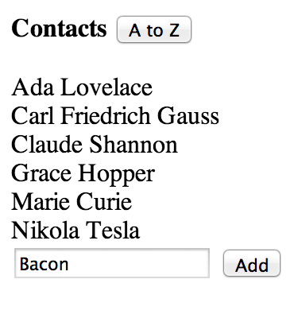
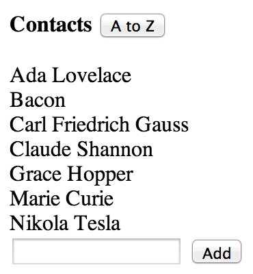
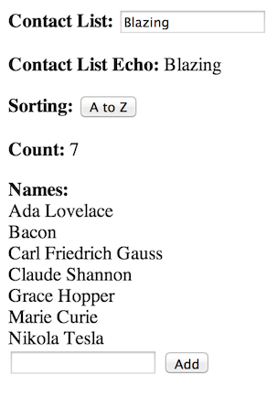
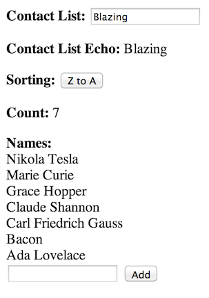

# Using Bacon and Blaze to implement reactive components

1. The component holds a Bacon model and mutator methods.
2. The view uses Blaze variable(s) and exposes helpers for the Spacebar template.
3. The component model propagates its changes to the Blaze variable(s).
4. Changes to the Blaze variables are only made by this propagation mechanism.
5. Blaze supports model-to-view binding out-of-the-box
6. For view-to-model or 2-way bindings it is easy to map events to Bacon model lenses

It is also possible to use Bacon's bindings.


Modified example from: http://codepen.io/imslavko/pen/KhAyp .

 
 

```
<head>

    <!-- The template named "main" automatically renders into the document body -->
    <script type="text/spacebars" name="main">
        <p><b>Contact List:</b> <input type="text" id="list-name"/></p>
        <p><b>Contact List Echo: </b> {{model.listName}}</p>
        <p><b>Sorting:</b> <button id="toggle-order">{{order}}</button></p>
        <p><b>Count: </b>{{model.names.length}}</p>
        <b> Names:</b>
         {{#each contacts}}
           <div>{{.}}</div>
         {{/each}}

         <form>
           <input type="text" id="new-contact">
           <input type="submit" value="Add">
         </form>

         <input type="checkbox" id="check1" {{checked}}>
         <input type="checkbox" id="check2" {{checked}}>
  </script>

    <script src="http://meteor.github.io/blaze/blaze-0.1.js"></script>
    <script src="http://rawgithub.com/baconjs/bacon.js/master/dist/Bacon.min.js"></script>
    <script src="http://rawgithub.com/baconjs/bacon.model/master/dist/bacon.model.min.js"></script>

    <script>
        function blazify(model, name) {
            if (name) {
                var b = Blaze.Var(model.get()[name]);
                model.lens(name).onValue(b, "set");
                return b;
            }
            else {
                var b = Blaze.Var(model.get());
                model.log().onValue(b, "set");
                return b;
            }
        }

        function sorted (arr, asc) {
            var cloned = arr.slice(0);
            cloned.sort(); // sort in-place
            if (!asc)
                cloned.reverse(); // reverse in-place
            return cloned;
        };

        function binder(component, name, type) {
            return function(ev) {
                var val = null;
                if (type === "switch") {
                   val = $(ev.target).is(":checked");
                }
                else if (type === "enter" && ev.keyCode === 13) {
                    val = $(ev.target).val();
                }
                if(val == null) {
                   val = $(ev.target).val();
                }
                component.set(name, val);
            }
        }

        function componentFactory() {
            var model = new Bacon.Model({check:false,
                ascending: true,
                names: ["Carl Friedrich Gauss", "Marie Curie",
                    "Grace Hopper", "Claude Shannon",
                    "Ada Lovelace", "Nikola Tesla" ]
            });
            return {
                blazify: function(name) {
                    return blazify(model, name);
                },
                set: function(name, val) {
                    model.lens(name).set(val);
                },
                toggleOrder: function () { model.lens("ascending").set(! model.get().ascending); },
                addName: function (evt, tmpl) {
                    var allNames = model.get().names;
                    // grab the new contact name from the DOM and clear the input field.
                    var newName = tmpl.find('#new-contact').value;
                    tmpl.find('#new-contact').value = '';
                    model.lens("names").set(allNames.concat([newName])); // update the data model
                    return false; // don't try to submit a form
                }
            }
        };

        function viewFactory(component) {
            //var names = component.blazify("names");
            //var ascending = component.blazify("ascending");
            var model = component.blazify();

            return {
                helpers: {
                    model: function() { return model.get(); },
                    order: function () { return model.get().ascending ? 'A to Z' : 'Z to A'; },
                    contacts: function () { return sorted(model.get().names, model.get().ascending); },
                    checked: function() { return model.get().check ? "checked" : ""}
                }
            }
        };

        var component = componentFactory();
        var view = viewFactory(component);
    </script>

    <script>
        Template.main.helpers(view.helpers);

        Template.main.events({
            'click #toggle-order': component.toggleOrder,
            'submit form': component.addName,
            'keyup #list-name': binder(component, "listName"),
            'change #check1': binder(component, "check", "switch"),
            'change #check2': binder(component, "check", "switch")
        });
    </script>

</head>

```