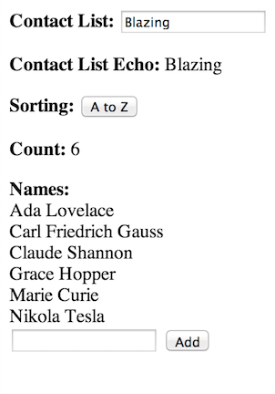
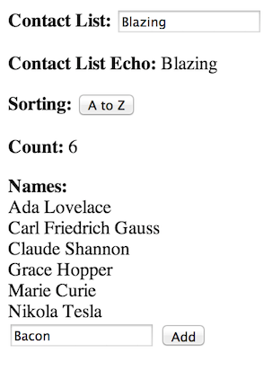

# Using Bacon and Blaze to implement reactive components

 

```
<head>

    <!-- The template named "main" automatically renders into the document body -->
    <script type="text/spacebars" name="main">
        <p><b>Contacts</b> <button id="toggle-order">{{order}}</button></p>
         {{#each contacts}}
           <div>{{.}}</div>
         {{/each}}

         <form>
           <input type="text" id="new-contact">
           <input type="submit" value="Add">
         </form>
     </script>

    <script src="http://meteor.github.io/blaze/blaze-0.1.js"></script>
    <script src="http://rawgithub.com/baconjs/bacon.js/master/dist/Bacon.min.js"></script>
    <script src="http://rawgithub.com/baconjs/bacon.model/master/dist/bacon.model.min.js"></script>

  </script>

    <script src="http://meteor.github.io/blaze/blaze-0.1.js"></script>
    <script src="http://rawgithub.com/baconjs/bacon.js/master/dist/Bacon.min.js"></script>
    <script src="http://rawgithub.com/baconjs/bacon.model/master/dist/bacon.model.min.js"></script>

    <script>
        function blazify(model, name) {
            var b = Blaze.Var(model.get()[name]);
            model.lens(name).onValue(b, "set");
            return b;
        }

        function sorted (arr, asc) {
            var cloned = arr.slice(0);
            cloned.sort(); // sort in-place
            if (!asc)
                cloned.reverse(); // reverse in-place
            return cloned;
        };

        function componentFactory() {
            var model = new Bacon.Model({
                ascending: true,
                names: ["Carl Friedrich Gauss", "Marie Curie",
                    "Grace Hopper", "Claude Shannon",
                    "Ada Lovelace", "Nikola Tesla" ]
            });
            return {
                model: model,
                toggleOrder: function () { model.lens("ascending").set(! model.get().ascending); },
                addName: function (evt, tmpl) {
                    var allNames = model.get().names;
                    // grab the new contact name from the DOM and clear the input field.
                    var newName = tmpl.find('#new-contact').value;
                    tmpl.find('#new-contact').value = '';
                    model.lens("names").set(allNames.concat([newName])); // update the data model
                    return false; // don't try to submit a form
                }
            }
        };

        function viewFactory(component) {
            var names = blazify(component.model, "names");
            var ascending = blazify(component.model, "ascending");

            return {
                helpers: {
                    order: function () { return ascending.get() ? 'A to Z' : 'Z to A'; },
                    contacts: function () { return sorted(names.get(), ascending.get()); }
                }
            }
        };


        var component = componentFactory();
        var view = viewFactory(component);
    </script>

    <script>
        Template.main.helpers(view.helpers);

        Template.main.events({
            'click #toggle-order': component.toggleOrder,
            'submit form': component.addName
        });
    </script>

</head>
```